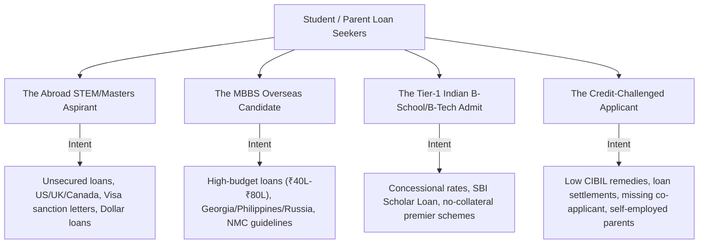

# Visionary Path Services — Strategic Content Marketing Plan
**Author:** Antigravity Content Strategist  
**Date:** September 2026  
**Target Domain:** www.visionarypathservices.com  

---

## 1. Executive Summary & Brand Positioning

**Visionary Path Services** is a premier education loan assistance and financial guidance consultancy in India. The brand differentiates itself from aggressive aggregators by focusing on:
1. **Profile-First Matching:** Tailoring options to student academic credentials and co-applicant financial realities rather than pushing single-bank partnerships.
2. **Transparent, Zero-False-Promise Culture:** Educating families with realistic sanction timelines, actual margin money calculations, and genuine interest rate comparisons.
3. **End-to-End Handholding:** From CIBIL health checks and collateral documentation to sanction letter disbursement and international forex wire transfers.

### Core Objectives
* **Organic Search Authority (SEO):** Capture high-intent queries across education loans (domestic, abroad, MBBS, CIBIL, collateral, no-cosigner).
* **Direct Lead Generation (CRO):** Funnel informational traffic directly into the **Free Eligibility Assessment Tool** and WhatsApp counseling workflows.
* **Ethical Competitive Differentiation:** Ethically analyze and surpass competitor content (e.g., WeMakeScholars, GyanDhan) through richer data, interactive comparison tables, transparent policy breakdowns, and clean legal compliance.

---

## 2. Customer Research & Search Intent Archetypes

Indian education loan seekers generally fall into 4 distinct archetypes:

### Critical Questions Customers Ask Before Reaching Out:
1. *"Whose CIBIL is checked? Mine or my father's?"*
2. *"Can I get an abroad education loan without pledging property?"*
3. *"Does SBI or Bank of Baroda give loans for MBBS abroad?"*
4. *"Can my uncle or mother be my primary co-applicant instead of my father?"*
5. *"How do I show funds for US visa (I-20) interview without paying interest upfront?"*

---

## 3. Four Core Content Pillars & Topic Clusters (Hub & Spoke Model)

To establish topical authority, content is divided into 4 main pillars with a **Hub & Spoke** structure:

### Pillar 1: Eligibility, CIBIL & Financial Readiness (High Conversion)
* **Hub:** The Complete Guide to Education Loan Eligibility in India (2026)
  * *Spoke 1.1:* How CIBIL Score Affects Your Education Loan Approval (Public Banks vs NBFCs)
  * *Spoke 1.2:* How to Get an Education Loan with Low CIBIL or Past Loan Settlement
  * *Spoke 1.3:* Co-Applicant Rules: Who Qualifies and What If Parents Are Retired?
  * *Spoke 1.4:* Complete Education Loan Documents Checklist for Students & Co-Applicants

### Pillar 2: Country-Specific Education Loan Blueprints (High Search Volume)
* **Hub:** Comprehensive Guide to Financing Studies Abroad
  * *Spoke 2.1:* Education Loans for USA: I-20 Proof of Funds, STEM Courses & Prodigy/MPOWER
  * *Spoke 2.2:* Education Loans for UK: CAS Letter Financial Requirements & Living Cost Sizing
  * *Spoke 2.3:* Education Loans for Germany: APS Certificate, Blocked Account (Sperrkonto) Financing
  * *Spoke 2.4:* Education Loans for Canada: GIC Sizing, SDS Category Rules & Fast Disbursement
  * *Spoke 2.5:* Education Loans for Australia: Genuine Student (GS) Financial Scrutiny Guide

### Pillar 3: Loan Architecture — Collateral vs Non-Collateral
* **Hub:** Secured vs Unsecured Education Loans: Which Is Right for You?
  * *Spoke 3.1:* Collateral Education Loans: Acceptable Properties, Valuation, Legal Title Clearance
  * *Spoke 3.2:* Non-Collateral Loans up to ₹50 Lakhs: Best NBFCs & Private Banks Compared
  * *Spoke 3.3:* Dollar-Denominated Loans vs INR Loans: Currency Risk & Repayment Reality
  * *Spoke 3.4:* Education Loan Takeover / Refinancing: How to Reduce EMI After Graduation

### Pillar 4: Medical & Professional Course Financing
* **Hub:** MBBS Education Loans in India & Abroad: Complete Feasibility Guide
  * *Spoke 4.1:* How to Fund MBBS in Georgia, Philippines, Uzbekistan, and Russia
  * *Spoke 4.2:* Section 80E Tax Benefits on Education Loan Interest: How to Claim Maximum Rebate
  * *Spoke 4.3:* Vidya Lakshmi Portal vs Direct Bank Application: What You Need to Know

---

## 4. Competitor Repurposing Framework (Legally Safe & Ethically Superior)

When assessing topics covered by competitors (e.g., WeMakeScholars, GyanDhan):

1. **Extract the Core Intent, Not the Text:** Identify the question the user entered into Google.
2. **Fact Verification:** Cross-reference bank circulars (SBI Global Ed-vantage, BoB Baroda Scholar, Axis Education Loan schemes, HDFC Credila policies) for latest interest rates, processing fees, and margin money.
3. **Add Value Layers:**
   * **Comparative Data Tables:** Present structured side-by-side matrices (rates, cutoff scores, maximum limits).
   * **Real Student Case Scenarios:** Provide concrete numerical illustrations (e.g., *"Case Study: Student securing ₹40 Lakhs with co-applicant score of 630"*).
   * **Direct CTA Triggers:** Connect actionable takeaways to Visionary Path Services' free counseling and eligibility checker.
4. **Zero Plagiarism Guarantee:** Original writing, original code/HTML structure, original metadata, zero scraper footprints.

---

## 5. Twelve-Week Editorial Calendar

| Week | Target Topic | Target Primary Keyword | Search Intent | Est. Word Count | Lead Funnel Hook |
| :---: | :--- | :--- | :--- | :--- | :--- |
| **W1** | CIBIL Score Impact on Education Loans | `CIBIL score for education loan` | Informational / Commercial | 2,200+ | Free CIBIL Evaluation & Bank Match |
| **W2** | Education Loans for USA (I-20 Ready) | `education loan for study in USA` | Transactional | 2,500+ | US Loan Pre-Sanction in 7 Days |
| **W3** | Non-Collateral Education Loans up to ₹50L | `unsecured education loan for abroad` | High Intent | 2,000+ | NBFC & Private Bank Instant Eligibility |
| **W4** | Complete Documents Checklist for 2026 | `documents required for education loan` | Informational | 1,800+ | Downloadable PDF Checklist |
| **W5** | MBBS Abroad Education Loans | `education loan for MBBS abroad` | High Commercial | 2,400+ | Medical College Sanction Support |
| **W6** | Education Loans for Germany (Blocked Acc) | `education loan for Germany blocked account` | Informational / Transactional | 2,100+ | Blocked Account & Tuition Funding |
| **W7** | Who Can Be a Co-Applicant? | `co applicant for education loan` | Informational | 1,900+ | Alternative Guarantor Assessment |
| **W8** | Section 80E Income Tax Deduction Guide | `section 80E education loan tax benefit` | Financial Planning | 1,700+ | Tax Savings Calculator Link |
| **W9** | SBI vs Private Banks vs NBFCs Comparison | `best bank for education loan abroad` | Commercial Comparison | 2,800+ | Interactive Bank Rate Comparison |
| **W10** | Education Loans for UK (CAS & Living Cost) | `education loan for UK studies` | Transactional | 2,200+ | Fast-Track UK CAS Letter Approval |
| **W11** | Property Valuation & Collateral Legal Guide | `collateral for education loan` | Informational | 2,000+ | Property Evaluation & Title Guidance |
| **W12** | Dollar Loans vs Rupee Loans (Prodigy/MPOWER) | `dollar education loans for Indian students` | High Intent | 2,300+ | No-Cosigner Loan Assessment |

---

## 6. On-Page SEO & Conversion Checklist for Every Blog

Every blog post published on `www.visionarypathservices.com` must meet the following quality standards:
* **H1 Tag:** Includes primary keyword naturally with high emotional/clarity hook.
* **H2/H3 Structure:** Reflects Google "People Also Ask" sub-questions.
* **Schema Markup:** Includes JSON-LD structured data for `Article`, `FAQPage`, and `BreadcrumbList`.
* **Visual Anchor:** High-contrast comparison table or structured checklist.
* **Internal Links:** Minimum 3 internal links to relevant service pages (`/pages/abroad-loans.html`, `/pages/domestic-loans.html`, `/pages/services.html`).
* **Lead Magnets / CTAs:**
  * Inline context banner promoting the Free Profile Assessment.
  * Bottom conversion card with direct phone (+91 9063703038) and WhatsApp counseling link.
